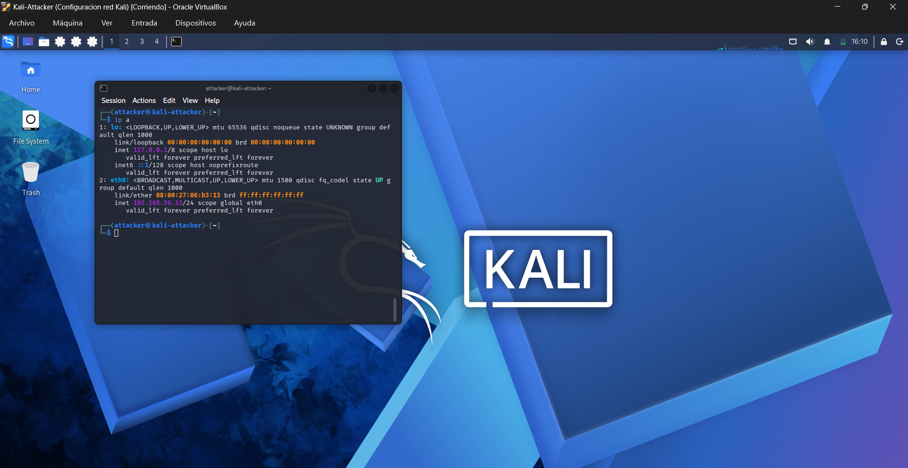
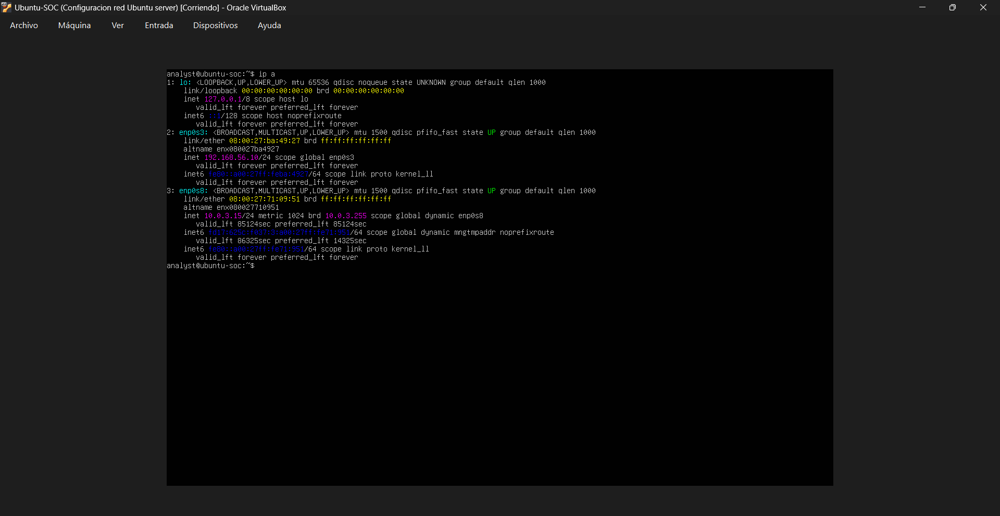
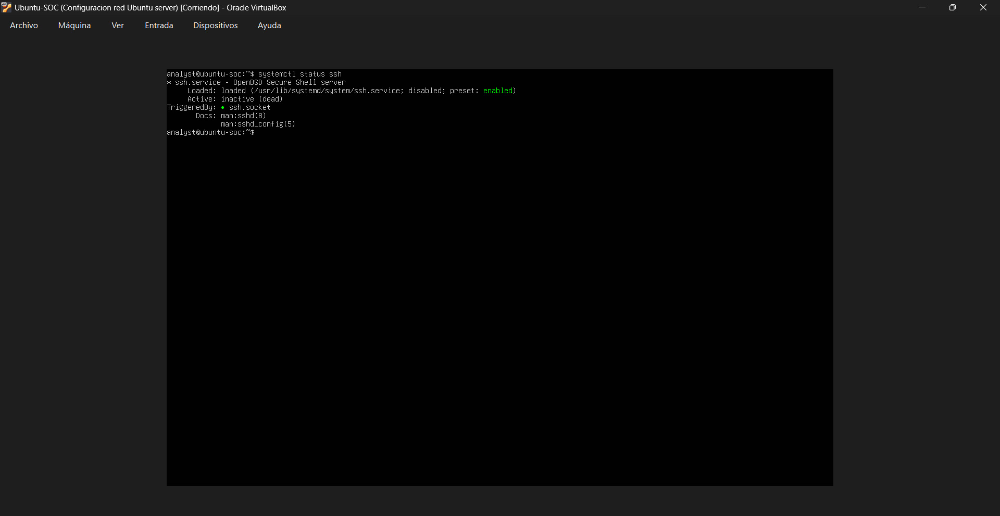
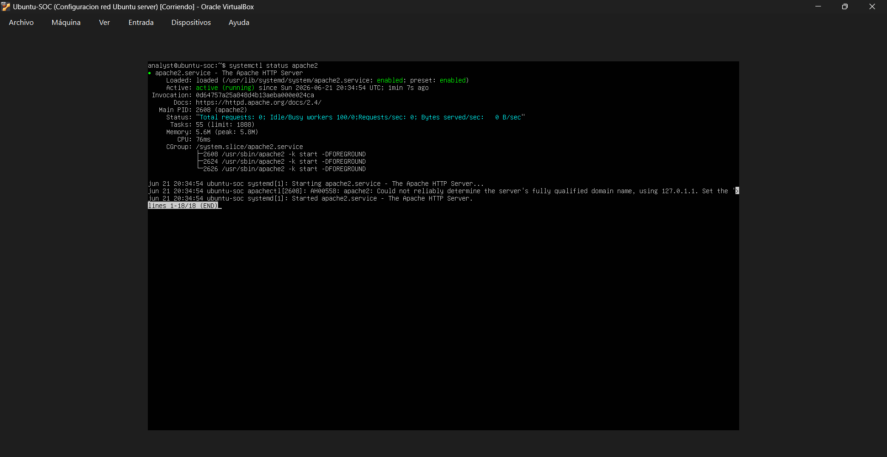
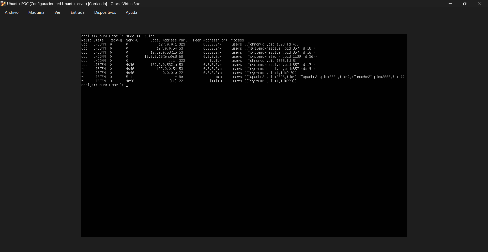
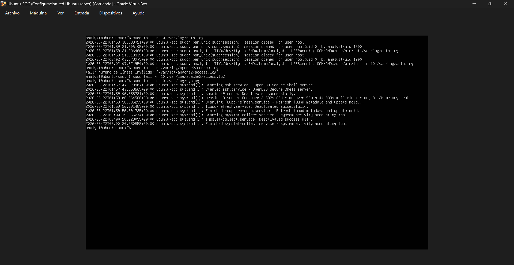
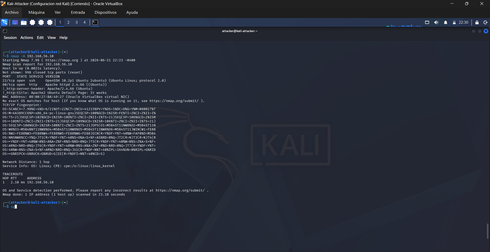
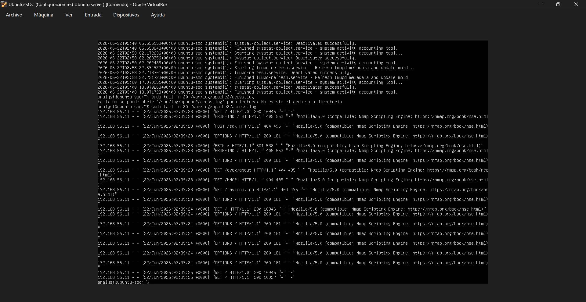
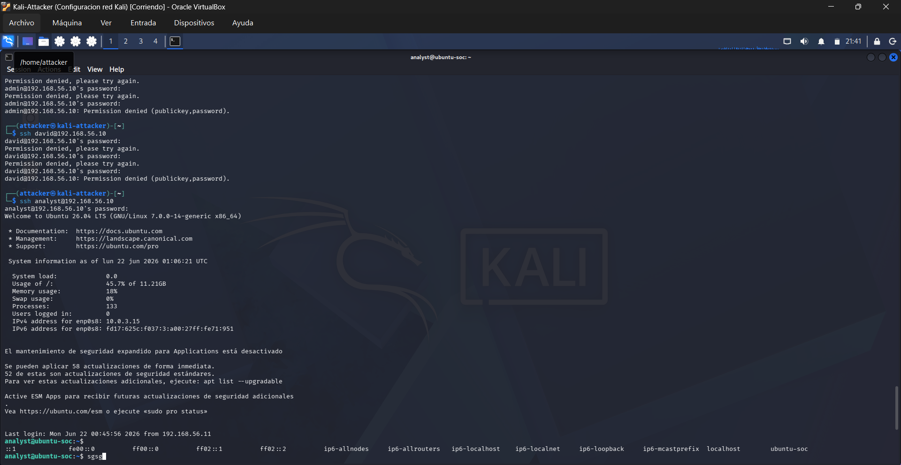
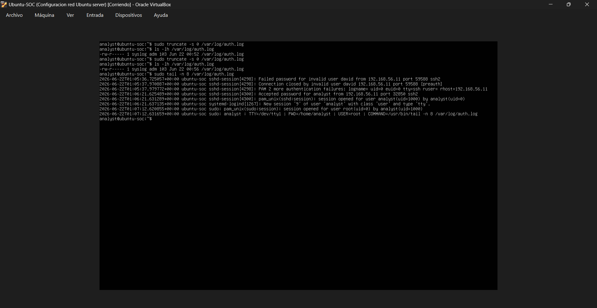

# SOC Log Analysis Lab

A hands-on cybersecurity lab focused on attack simulation, log analysis, incident investigation, and defensive documentation.

This repository documents practical blue team exercises performed in a controlled environment using Ubuntu Server as the target system and Kali Linux as the attacking machine.

---

## Project Objective

The goal of this project is to simulate real-world attack scenarios and analyze their impact from a SOC Tier 1 perspective.

Main focus areas:

* Linux authentication log analysis
* Network reconnaissance
* SSH brute force detection
* Web enumeration analysis
* Apache access log investigation
* Incident documentation
* Threat detection automation

---

## Lab Architecture

```text
Kali Linux (Attacker) ---> Ubuntu Server (Victim)
```

Environment:

* Kali Linux
* Ubuntu Server
* VirtualBox Internal Network: `SOC-LAB`
* NAT enabled for internet access

---

## Network Configuration

### Ubuntu Server

IP Address:

```text
192.168.56.10
```

### Kali Linux

IP Address:

```text
192.168.56.11
```

Validation:

* Successful ping between both machines
* Internal communication established

Evidence:





---

## Services Installed

### SSH

Service status:



Purpose:

* Remote administration
* Authentication analysis
* Brute force simulation target

---

### Apache

Service status:



Purpose:

* Web enumeration analysis
* HTTP request logging
* Web attack simulation

---

## Open Ports Validation

Open ports identified:

* Port 22 (SSH)
* Port 80 (HTTP)

Evidence:



---

## Baseline Log Documentation

Before launching attacks, baseline logs were reviewed to establish normal system behavior.

Reviewed logs:

* `/var/log/auth.log`
* `/var/log/apache2/access.log`
* `/var/log/syslog`

Purpose:

* Understand normal system activity
* Create comparison points for future attacks
* Improve incident visibility

Evidence:



---

## Completed Phases

### Phase 1 — Infrastructure Setup

Completed:

* Ubuntu installation
* Kali installation
* VirtualBox networking configuration
* Internal communication validation
* Initial documentation

Documentation:

* `lab-setup/kali-setup.md`
* `lab-setup/ubuntu-server-setup.md`
* `lab-setup/network-diagram.md`

---

### Phase 2 — Victim Preparation & Baseline

Completed:

* System update
* SSH verification
* Apache verification
* Open ports validation
* Baseline log inspection

---

### Phase 3 — Reconnaissance with Nmap

Completed:

Reconnaissance included:

* Open port discovery
* Service enumeration
* Version detection
* OS fingerprinting
* HTTP endpoint probing
* NSE script execution

Findings:

* OpenSSH 10.2p1
* Apache 2.4.66
* Linux OS fingerprint confirmed

Apache log evidence showed:

* GET /
* OPTIONS /
* PROPFIND /
* POST /sdk
* GET /HNAP1
* GET /evox/about

Evidence:





Documentation:

* `reports/nmap-scan-report.md`

MITRE ATT&CK:

* T1595 — Active Scanning
* T1046 — Network Service Discovery

---

### Phase 4 — SSH Brute Force Analysis

Completed:

Attack simulation included:

* Invalid user attempts
* Failed password authentication
* Successful login validation
* Privilege escalation visibility

Evidence:





Documentation:

* `reports/ssh-bruteforce/incident-report.md`

MITRE ATT&CK:

* T1110 — Brute Force
* T1078 — Valid Accounts

---

## Repository Structure

```text
soc-log-analysis-lab/
├── README.md
├── lab-setup/
├── logs/
├── reports/
├── screenshots/
├── scripts/
└── notes/
```

---

## Roadmap

### Phase 5 — Web Enumeration with Gobuster

Goal:

* Enumerate directories
* Generate Apache logs
* Detect suspicious requests

Planned report:

* `reports/web-enumeration-report.md`

---

### Phase 6 — Manual Log Analysis

Examples:

```bash
grep "Failed password" /var/log/auth.log
grep "Accepted password" /var/log/auth.log
grep "/admin" /var/log/apache2/access.log
```

Goal:

* Detect suspicious behavior manually
* Improve Linux log analysis skills

---

### Phase 7 — Python Automation

Planned scripts:

* `failed_logins.py`
* `count_failed_logins_by_ip.py`
* `suspicious_web_requests.py`
* `sudo_activity_parser.py`

Goal:

* Automate event detection
* Reduce manual analysis time

---

### Phase 8 — SOC Reports

Standard format:

* Summary
* Source IP
* Target
* Evidence
* Impact
* Recommendations

---

## Current Focus

Current active phase:

```text
Phase 5 — Web Enumeration with Gobuster
```

Next attack:

```bash
gobuster dir -u http://192.168.56.10 -w wordlist.txt
```

---

## Analyst Notes

This repository represents my practical transition into cybersecurity with emphasis on:

* SOC operations
* Blue team fundamentals
* Linux security
* Log analysis
* Incident response
* Threat detection

Current training:

* Cisco CCST Cybersecurity
* Linux log analysis
* SOC Tier 1 preparation
