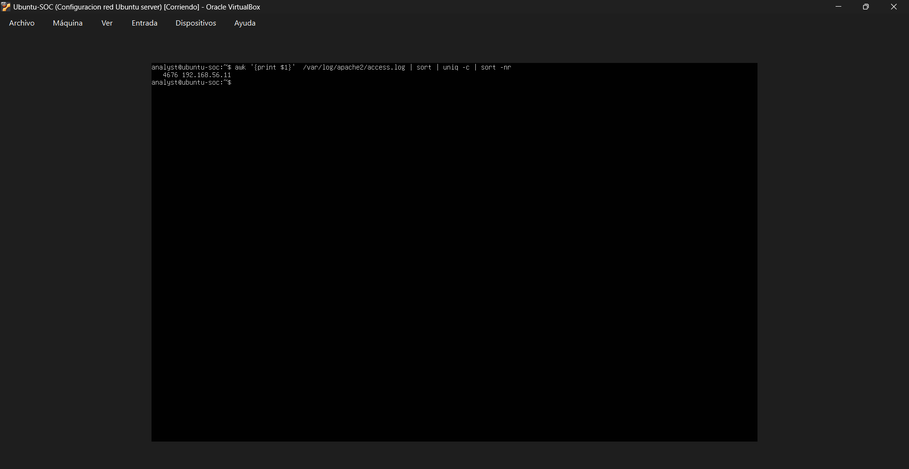
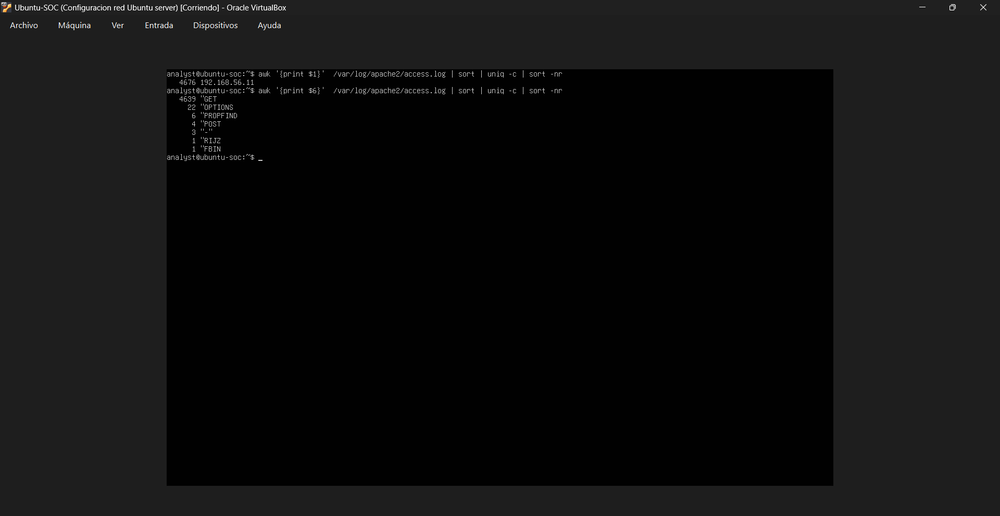

# Manual Log Analysis Notes

## Overview

This phase focuses on manually reviewing logs to identify suspicious activity generated during previous attack simulations.

The objective is to identify attacker behavior, extract indicators of compromise (IoCs), and correlate events.

---

## Source IP Analysis

Command used:

```bash
awk '{print $1}' /var/log/apache2/access.log | sort | uniq -c | sort -nr
```

Evidence:



Result:

```text
4676 192.168.56.11
```

Analysis:

All suspicious traffic originated from a single source.

Source IP identified:

```text
192.168.56.11
```

Associated activity:

* Nmap reconnaissance
* Gobuster enumeration
* HTTP probing

This confirms a centralized attack origin.

---

## HTTP Method Analysis

Command used:

```bash
awk '{print $6}' /var/log/apache2/access.log | sort | uniq -c | sort -nr
```

Evidence:



Result:

```text
4639 GET
22 OPTIONS
6 PROPFIND
4 POST
```

Analysis:

### GET

Used for:

* Normal requests
* Enumeration
* Path discovery

---

### OPTIONS

Used for:

* Method discovery
* Service fingerprinting

Strong indicator of reconnaissance.

---

### PROPFIND

Rare in legitimate environments.

Used for:

* WebDAV detection
* Capability discovery

Suspicious behavior.

---

### POST

Used during active probing.

Requires additional investigation.

---

## Failed Authentication Analysis

Command used:

```bash
grep "Failed password" /var/log/auth.log
```

Evidence:


Purpose:

Identify brute force attempts and invalid user authentication.

---

## Successful Authentication Analysis

Command used:

```bash
grep "Accepted password" /var/log/auth.log
```

Evidence:


Purpose:

Identify successful logins after brute force or valid access.

---

## Privilege Escalation Activity

Command used:

```bash
grep "sudo:" /var/log/auth.log
```

Evidence:


Purpose:

Track privileged command execution after authentication.

---

## Nmap Detection

Command used:

```bash
grep "Nmap" /var/log/apache2/access.log
```

Evidence:


Purpose:

Detect Nmap Scripting Engine activity in HTTP logs.

Indicators:

* OPTIONS
* PROPFIND
* unusual endpoint probing

---

## Gobuster Detection

Command used:

```bash
grep "gobuster" /var/log/apache2/access.log
```

Evidence:


Purpose:

Detect directory brute force activity.

Indicators:

* Sequential requests
* High frequency
* Enumeration patterns

---

## 404 Burst Analysis

Command used:

```bash
grep ' 404 ' /var/log/apache2/access.log
```

Evidence:


Purpose:

Detect path discovery failures and aggressive enumeration.

---

## Suspicious Indicators Identified

Observed:

* Single-source high-volume traffic
* Automated scanning behavior
* Enumeration patterns
* Rare HTTP methods
* Repeated failed authentication
* Privileged activity after login

---

## Conclusion

Manual log analysis successfully identified:

* Attacker source IP
* Reconnaissance behavior
* Enumeration patterns
* Suspicious HTTP methods
* Brute force evidence
* Privilege escalation activity

This phase demonstrates the importance of manual triage before moving into automated detection.
